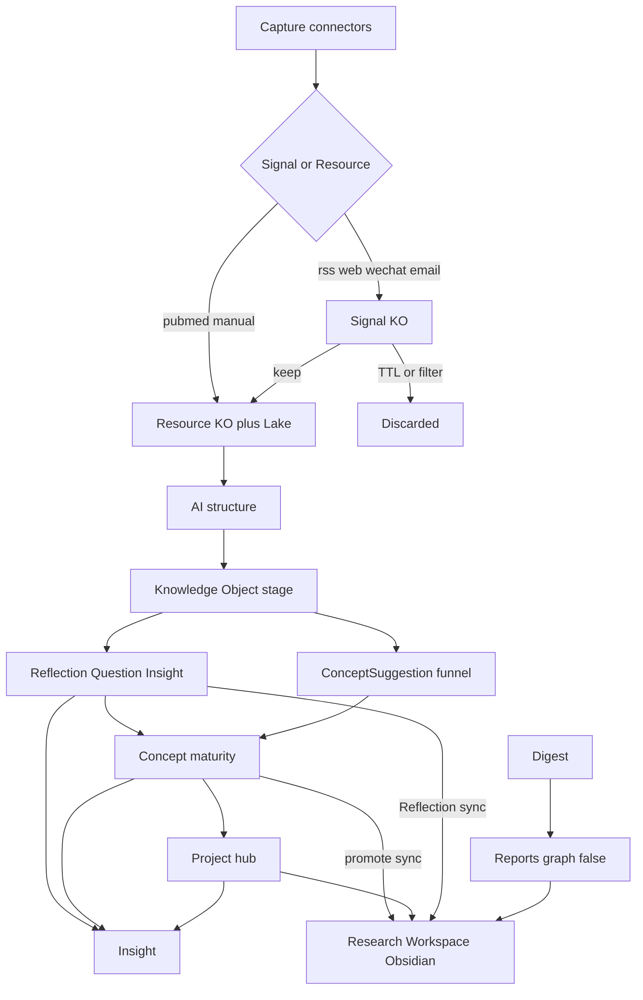
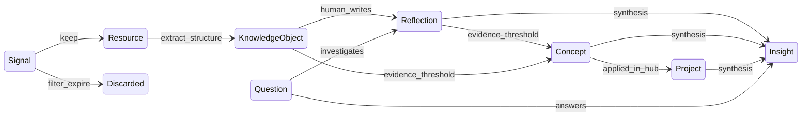
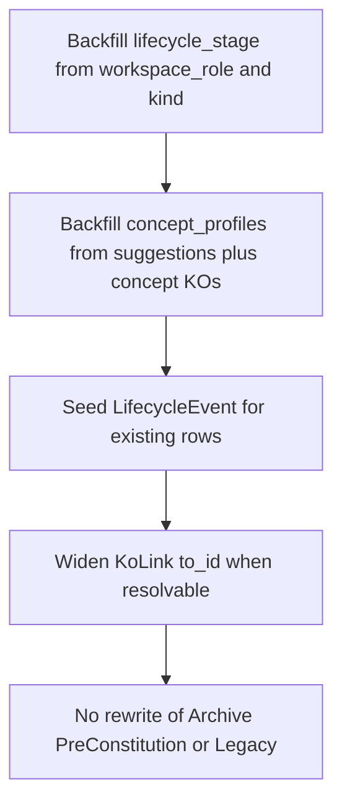

# Research Brief — Knowledge OS Architecture (System baseline)

**Status:** Living document for **system architecture** (Content Lake, Knowledge Database, Lifecycle, Graph Engine).  
**Obsidian-facing SoT (supersedes §1 Obsidian principle + §6 below):** [`architecture/OBSIDIAN_CONSTITUTION_V1_1.md`](architecture/OBSIDIAN_CONSTITUTION_V1_1.md)  
**Conflict reconciliation:** [`architecture/OBSIDIAN_CONSTITUTION_CONFLICTS.md`](architecture/OBSIDIAN_CONSTITUTION_CONFLICTS.md)

> **Thinking Vault priority (2026-08):** For personal thinking capture, Notion → Obsidian sync, and vault cognitive roots (`Information/` · `Thinking/` · `Research/`), follow  
> [`architecture/THINKING_VAULT_ARCHITECTURE.md`](architecture/THINKING_VAULT_ARCHITECTURE.md) and  
> [`architecture/THINKING_VAULT_MIGRATION.md`](architecture/THINKING_VAULT_MIGRATION.md).  
> Those documents **supersede** conflicting rules below (including “Notion as non-goal”). Obsidian vault IA follows Constitution V1.1 + Thinking Vault. This file remains the inventory for Content Lake, KO spine, Lifecycle, and Graph Engine.

**Source plans (historical; do not treat as current Obsidian SoT):**

| Plan | Contribution |
|------|----------------|
| Obsidian Thinking Workspace | Content Lake + Knowledge Object spine; Obsidian as projection |
| Workspace Constitution V1 | Curated Research Workspace; Resources never auto-dump; promote/suggest — **Obsidian rules superseded by V1.1** |
| Lifecycle Engine Design | Intellectual lifecycle, maturity, history, Reflection/Question/Insight |
| Knowledge Graph Engine V1 | Cognitive graph projection; views/metrics/API independent of visualization |

---

## 1. First principles

1. ~~**Obsidian is not a content repository.** It is the Thinking Workspace.~~ **Superseded (V1.1):** Obsidian is the local cognitive storage layer — `Information/` + `Thinking/` + `Research/`. Capture may write readable Information notes. See Constitution V1.1.
2. **Raw bytes belong in the Content Lake** (immutable, write-once). Lake paths are not vault/graph nodes.
3. **Structured memory belongs in the Knowledge Database** (SQLite).
4. **Knowledge is not static.** The product records and supports the *evolution of understanding*.
5. **AI proposes; humans confirm** for Concept maturity, Insight creation, vault materialization, and non-obvious graph links.

Success criteria shift from “What documents do I have?” to:

- How has my understanding evolved?
- Which concepts are becoming central?
- Which research questions remain unresolved?
- What insights have emerged?
- What changed in my thinking?

---

## 2. Three layers + lifecycle spine



| Layer | Authority | Contents |
|-------|-----------|----------|
| **Content Lake** | Immutable bytes | Originals / media under `DATA_DIR/content_lake` |
| **Knowledge Database** | Structured memory | All KOs, edges, profiles, events, suggestions, SourceDoc/chunks |
| **Graph Engine** | Cognitive projection | Filtered nodes/edges, weights, communities, metrics (JSON API) |
| **Cognitive Vault (Obsidian)** | Human-readable cognitive objects | `Information/` · `Thinking/` · `Research/` (V1.1) |

**Orthogonal bindings (never collapse):**

| Field | Meaning |
|-------|---------|
| `lifecycle_stage` | Intellectual state in the DB |
| `workspace_role` | Backend presentation hint; vault folder = cognitive role (`information` / `thinking` / `research`) per V1.1 |
| Graph inclusion / `graph_layer` | Cognitive visibility (computed on sync; ≠ `workspace_role`) |
| `primary_content_uri` / Lake | Raw authority |
| `kind` | Medium / type (`paper`, `book`, …) |

`graph_eligible` on KO is an Obsidian frontmatter hint only. The Graph Engine uses its own inclusion rules.

A Concept can be `lifecycle_stage=concept`, `maturity=candidate` **before** any vault note exists.

---

## 3. Lifecycle stages



| Stage | Meaning | System of record | Obsidian |
|-------|---------|------------------|----------|
| `signal` | Ephemeral intake; most die | KO + TTL / `filter_status` | Never |
| `resource` | Preserved original | Lake + KO pointer | Never |
| `knowledge_object` | AI-structured memory | KO summary/entities/scores | Never |
| `reflection` | Human-owned thinking | `reflections` + KO | Sync when written (default on) |
| `concept` | Evolving idea | `concept_profiles` + KO | Sync at ≥ emerging or user promote |
| `project` | Applied knowledge hub | `project_profiles` + KO | Sync as Project note |
| `insight` | Highest-value synthesis | `insights` + KO | DB-first; optional `Insights/` if configured |
| `question` | Open research driver | `questions` + KO | DB-first; no auto folder |
| `discarded` | Filtered / expired signal | KO archived | Never |

Stages are **not** a single path: one Resource can feed many Reflections; Concepts need not sit under a Project; Questions may attach anytime after Resource.

### Connector intake rules

| Connectors | Initial stage |
|------------|---------------|
| `pubmed`, `manual` | Skip signal → `resource` + Lake immediately |
| `rss`, `web`, `wechat`, `email` | Enter as `signal` (filterable; Lake on keep) |

Config: [`backend/configs/lifecycle.yaml`](../backend/configs/lifecycle.yaml).

---

## 4. Entity model

### 4.1 KnowledgeObject (universal spine)

Core fields plus lifecycle:

- `lifecycle_stage`, `evidence_score`, `confidence`, `maturity`
- `lifecycle_updated_at`, `signal_expires_at`, `filter_status`
- Presentation: `workspace_role`, `graph_eligible`, `vault_path`
- Content: summary, entities, tags, Lake URI, provenance

Example: `kind=paper`, `lifecycle_stage=knowledge_object`, `workspace_role=resource`.

### 4.2 First-class thinking entities (1:1 with KO id)

| Table | Key columns | Links (via Edge) |
|-------|-------------|------------------|
| `reflections` | `body_md`, author, importance, status, `open_questions_json` | `reflects_on` → KO/Concept/Project |
| `questions` | statement, status, priority, owner, answer_summary | `about`, `inspired_by`, `answered_by` |
| `insights` | statement, evidence_md, confidence, status | `supported_by`, `answers`, `derived_from` |

Question status: `open` → `investigating` → `partially_answered` → `answered` → `archived`.

### 4.3 Concept maturity + Project hub

**ConceptProfile:** `maturity_level` (`candidate` → `emerging` → `stable` → `core` → `deprecated`), `promotion_score`, mention/reflection/resource/project counts, persistence days, milestones (`first_seen_at`, `stable_at`, `core_at`).

**ConceptSuggestion** remains the auditable intake funnel; high mention counts feed candidate scoring / candidate Concept KOs (no vault until promote/accept).

**ProjectProfile:** objectives/roadmap markdown, `knowledge_score`, `active_question_count`, status (`active` / `paused` / `done`). Aggregation via Edges (`member_of` / `about`); Obsidian folders are projections, not the hub.

### 4.4 Typed Edge (`ko_links`)

Widened `KoLink`: `from_ko_id` / `to_ko_id`, `from_type` / `to_type`, `link_type` (edge type), `weight`, `evidence`, `created_by` (`ai` \| `user` \| `system`). Keep `to_name` for unresolved labels.

Minimum edge types: `derived_from`, `about`, `supports`, `contradicts`, `reflects_on`, `member_of`, `answers`, `inspired_by`, `cites`, `related_to`.

### 4.5 History and proposals

- **`lifecycle_events`** — append-only; never update/delete in app logic. Fields: stage/maturity from→to, `trigger`, `actor`, `payload_json`.
- **`lifecycle_proposals`** — pending stage/maturity bumps; human accept/dismiss (`auto_mature: false` by default).

---

## 5. Transitions and scoring

| Transition | Auto-apply? |
|------------|-------------|
| signal → discarded | Yes (TTL / applied filter) |
| signal → resource | Papers auto; news via filter recommend + human/apply |
| resource → knowledge_object | Yes on analyze success |
| → reflection / insight accept / question create | Human |
| → concept candidate / maturity bump | Propose; human confirm (default) |

**promotion_score (v1):**

```text
0.25*norm(mentions) + 0.25*norm(reflections) + 0.20*norm(resources)
+ 0.15*norm(projects) + 0.10*norm(days) + 0.05*ai_confidence
```

Thresholds (config): candidate ≥ 20, emerging ≥ 40, stable ≥ 65, core ≥ 85.

---

## 6. Research Workspace (Constitution V1) — SUPERSEDED

> **Superseded for Obsidian-facing rules by [Constitution V1.1](architecture/OBSIDIAN_CONSTITUTION_V1_1.md).**  
> The typed folder forest and “Resources never sync” rule below are historical. Do not implement new vault UX against this section.  
> Conflict decisions: [OBSIDIAN_CONSTITUTION_CONFLICTS.md](architecture/OBSIDIAN_CONSTITUTION_CONFLICTS.md).

### V1.1 vault roots (current)

```text
Information/
Thinking/
Research/
Archive/           # cold legacy only
90_Meta/           # system conventions only
```

### Legacy V1 vault roots (historical)

```text
Projects/
Concepts/
Books/
Reflections/
Insights/
Reports/…
Collections/
Archive/Legacy|PreConstitution-Inbox/
90_Meta/
```

### Legacy `workspace_role` → sync (historical)

| Role | Obsidian (V1) | V1.1 mapping |
|------|---------------|--------------|
| `resource` | Never | Readable notes via Information capture path |
| `concept` / `project` / `reflection` | Typed folders | → `Thinking/` (idea notes) |
| `book` | `Books/` | → `Information/` |
| `insight` | optional `Insights/` | → `Research/` |
| `report` | `Reports/` | → `Archive/Digests/` (not cognitive graph) |
| `archived` | Archive | Archive (unchanged) |

**Locked defaults retained under V1.1:**

- No living `Inbox/`; Capture → Processing → Information / Thinking.
- AI never auto-dumps Concept forests or uncontrolled wikilinks.
- Wikilinks only to existing notes (or intentional titles).
- Natural titles; no artificial ID filenames.
- References are URLs only — never `lake:` ids.
- Tags must not become a second taxonomy.

---

## 7. AI decision points

| Stage | Job | Module / surface |
|-------|-----|------------------|
| Signal | keep vs discard | `lifecycle_ai.filter_signal` |
| Resource | extract into Lake | ingest / content_lake |
| Knowledge Object | structure | `analyze.py` → `mark_analyzed` |
| Reflection | suggest questions + links to existing Concepts/Projects | `suggest_questions_from_reflection` |
| Concept | maturity proposal (+ future merge/dupes) | `propose_maturity` / evaluate |
| Project | context pack | `project_context_pack` |
| Question | reading suggestions | `suggest_reading_for_question` |
| Insight | draft; user accepts | `draft_insight` |

Every AI/system decision that mutates or recommends logs `lifecycle_events` (`ai_filter`, `ai_recommend`, `analyze`, …). Heuristics always work; LLM runs when configured.

---

## 8. Code map

| Area | Path |
|------|------|
| Schema | [`backend/app/db.py`](../backend/app/db.py) |
| Content Lake | [`backend/app/services/content_lake.py`](../backend/app/services/content_lake.py) |
| Knowledge / promote | [`backend/app/services/knowledge.py`](../backend/app/services/knowledge.py) |
| Workspace projection | [`backend/app/services/workspace.py`](../backend/app/services/workspace.py) |
| Lifecycle engine | [`backend/app/services/lifecycle.py`](../backend/app/services/lifecycle.py) |
| Lifecycle AI | [`backend/app/services/lifecycle_ai.py`](../backend/app/services/lifecycle_ai.py) |
| Graph Engine | [`backend/app/services/graph_engine.py`](../backend/app/services/graph_engine.py) |
| Thinking CRUD | [`backend/app/services/thinking.py`](../backend/app/services/thinking.py) |
| Config | [`workspace.yaml`](../backend/configs/workspace.yaml), [`lifecycle.yaml`](../backend/configs/lifecycle.yaml), [`graph.yaml`](../backend/configs/graph.yaml) |
| CLI | `app.cli.workspace`, `app.cli.lifecycle`, `app.cli.graph`, `app.cli.collect`, `app.cli.digest` |
| API | [`backend/app/api.py`](../backend/app/api.py) |
| Tests | `backend/tests/test_*.py` |

---

## 9. API surface (evolution product)

**Workspace / capture**

- `POST /api/collect` — Lake + Resource/Signal KO (no vault dump)
- `POST /api/knowledge/{id}/promote` | `demote`
- `GET /api/knowledge/suggestions` + accept
- `POST /api/notebooks/{id}/sync-workspace`
- `POST /api/digest/run`

**Lifecycle**

- `GET /api/lifecycle/evolution?ko_id=`
- `GET /api/lifecycle/concepts/central`
- `GET /api/lifecycle/questions?status=`
- `GET /api/lifecycle/insights`
- `GET /api/lifecycle/changes?since=`
- `GET|POST /api/lifecycle/proposals…`
- `POST /api/lifecycle/evaluate` | `backfill`
- `POST /api/lifecycle/signals/{id}/filter`
- `POST /api/lifecycle/reflections/{id}/assist`
- `GET /api/lifecycle/projects/{id}/context`
- `POST /api/lifecycle/insights/draft`
- `GET /api/lifecycle/questions/{id}/reading`

**Graph Engine**

- `POST /api/graph/sync`
- `GET /api/graph/view/{view_id}`
- `GET /api/graph/neighborhood?ko_id=&depth=`
- `GET /api/graph/path?from_id=&to_id=`
- `GET /api/graph/concept/{id}/history`
- `GET /api/graph/project/{id}`
- `GET /api/graph/timeline?since=`
- `GET /api/graph/questions/open`
- `GET /api/graph/metrics` | `stats` | `orphans`
- `POST /api/graph/ai/suggest-links`

**Thinking CRUD:** `POST /api/reflections`, `/questions`, `/insights`

Document search remains `POST /api/search` on Resources.

---

## 10. Migration (from static Constitution data)



| Prior state | Migrated |
|-------------|----------|
| role=resource + structured | `knowledge_object` |
| role=resource + empty | `resource` |
| role=concept | stage=concept, maturity≈emerging |
| role=reflection | `reflections` row (+ body from vault if present) |
| role=project | `project_profiles` stub |
| role=book | stage=knowledge_object, role stays book |
| pending suggestions | keep; feed scores |
| PreConstitution Inbox md | stay in Archive |

CLI: `python -m app.cli.lifecycle backfill`

SQLite: `create_all` + `_migrate_sqlite_columns` ALTER helpers. No Postgres required for this milestone.

---

## 11. Knowledge Graph Engine

Derived cognitive projection (rebuildable SQLite + JSON API). Not Obsidian Graph / React Flow / D3 / Neo4j.

- Tables: `graph_nodes`, `graph_edges`, `graph_communities`, `graph_metrics_snapshots`, `graph_sync_runs`
- Cognitive objective (V1.1): meaningful links between independent Information / Thinking / Research objects — not infrastructure graphs
- Signals never shown; resources/reports not default cognitive nodes
- Views: prefer `default`, `thinking`, `research`, `information`, `full_cognitive`; legacy type views may remain for debugging
- Sync from KO + KoLink; weights, communities; **no folder/DB/pipeline/status nodes**
- AI maintenance via `LifecycleProposal.payload_json.graph_action` (**propose-only**; human accept)
- Config: [`backend/configs/graph.yaml`](../backend/configs/graph.yaml)

---

## 12. Implementation history (delivered)

| Milestone | Delivered |
|-----------|-----------|
| Content Lake + KO spine | Lake service, ContentObject, KnowledgeObject, KoLink, analyze wiring |
| Constitution V1 | workspace_role, promote/demote, suggestions, vault roots, no capture dumps |
| Lifecycle Engine | stages, profiles, events, proposals, thinking CRUD, evolution APIs |
| Lifecycle AI | signal filter, reflection assist, project context, insight draft, reading suggest |
| Graph Engine V1 | projection sync, named views, metrics, communities, timeline, suggest-links |

---

## 13. Non-goals (still out of scope)

- Bi-directional Obsidian ↔ DB reflection sync protocol
- pgvector / full embedding redesign
- Auto-writing hundreds of Concept notes
- Auto-migration of Legacy `01_Raw` / PreConstitution Inbox into Concepts (or uncontrolled Information dumps)
- Reintroducing typed Constitution folder forests as daily IA
- ~~Notion as primary surface~~ → **superseded:** Notion is the Thinking input layer (see Thinking Vault docs)
- Zotero as a primary surface
- Website UI as Thinking editor (website remains a presentation consumer; Quartz garden is OK)
- Bidirectional Notion ↔ Obsidian sync (V1 is Notion → Obsidian only)
- Graph visualization clients (Obsidian Graph, React Flow, D3, Cytoscape, Neo4j Browser) as architecture dependencies
- Server-side force-directed layout as a product dependency
- Automatic AI link explosions or infrastructure nodes in the cognitive graph

---

## 14. Operator quick path

```bash
cd backend && source .venv/bin/activate

# Capture (Resources/Signals only)
python -m app.cli.collect --job ../jobs/nature_migraine.yaml --no-media

# Structure → knowledge_object (needs LLM for full distill)
# then:
python -m app.cli.lifecycle backfill
python -m app.cli.lifecycle evaluate --notebook nb_xxx
python -m app.cli.lifecycle proposals
python -m app.cli.lifecycle accept --proposal lpr_xxx --vault ../vault

# Human thinking
# API: POST /api/reflections | /questions | /insights
python -m app.cli.lifecycle assist-reflection --id ko_xxx
python -m app.cli.lifecycle central
python -m app.cli.lifecycle evolution --ko ko_xxx

# Vault sync for promoted notes
python -m app.cli.workspace sync --notebook nb_xxx --vault ../vault

# Cognitive graph (no UI — JSON only)
python -m app.cli.graph sync --notebook nb_xxx
python -m app.cli.graph view --view research --notebook nb_xxx
python -m app.cli.graph neighborhood --ko ko_xxx --depth 2
python -m app.cli.graph metrics --notebook nb_xxx
python -m app.cli.graph suggest-links --notebook nb_xxx
```

---

*When architecture decisions change, update this file first; Cursor plans under `~/.cursor/plans/` remain historical design records.*
