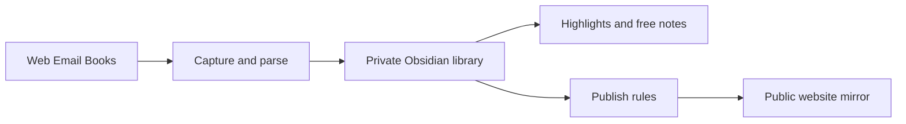
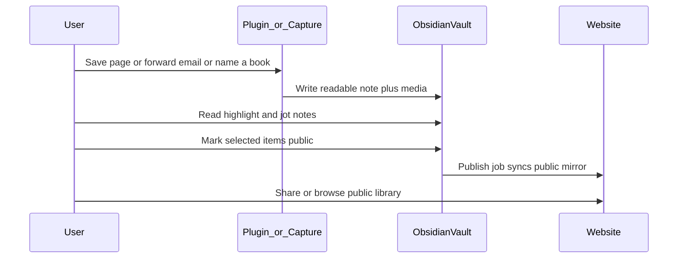

# Research Brief v1.0 — 产品与运作逻辑

**Status:** Canonical product SoT for **Library / Information reading capture** (v1.0)  
**Date:** 2026-08  
**Scope:** Product positioning, workflows, interaction, presentation for Save → Library → Publish. Not an implementation plan for Thinking Vault.

> **Split SoT (2026-08):**  
> - **This document** remains SoT for the Matter-style **Library reading** path (`Library/`, extension save, website mirror of reading notes).  
> - **Thinking Vault** is now product-priority for personal thinking: see [`architecture/THINKING_VAULT_ARCHITECTURE.md`](architecture/THINKING_VAULT_ARCHITECTURE.md) and [`architecture/THINKING_VAULT_MIGRATION.md`](architecture/THINKING_VAULT_MIGRATION.md).  
> - Where this document says Obsidian is *only* a reading library, or Welcome must not guide thinking, **Thinking Vault wins**. Do not implement Thinking features against Library-only assumptions.  
> - [`ARCHITECTURE.md`](ARCHITECTURE.md) remains the Knowledge OS inventory (Lake / KO / Lifecycle / Graph), subordinate to Thinking Vault on thinking sync and vault cognitive roots.

---

## 1. 背景与为何重设计

现行系统叠加了多层目标，产品叙事与日常体验脱节：

| 层 | 现状问题 |
|----|----------|
| 产品定位 | 从 NotebookLM 式研究简报漂移到 Knowledge OS，目标不断叠加 |
| Obsidian | Constitution 要求「不落原文」，同时又有 Archive / Legacy / PreConstitution、Concepts / Projects / Reports 等多角色文件夹——既不像干净阅读库，也不像轻思考本 |
| 运作 | Capture、Lifecycle、Graph、Workspace promote、Digest、Ask 并行，日常路径过碎 |
| 交互 | CLI + API 为主，缺少阅读面；Website 曾被标为 non-goal |

**根因：** 把「收藏阅读」与「知识演化操作系统」绑在同一产品里，Obsidian 被迫同时当仓库、投影面和思考本。

v1.0 主动收缩：先做成 Matter 式的**私人阅读/收藏库 + 对外镜像**，再决定是否叠加知识 OS。

---

## 2. 产品定位与成功标准

### 一句话

个人阅读与收藏系统——把网页、邮件、纸质书核心信息干净地收进**私人 Obsidian**，在上面做轻量笔记与高亮，再把**精选或整库镜像**发布到个人 **Website**。

### 对标

[Matter](https://www.getmatter.com/) 的 Save → Read → Highlight 闭环。差异在于：

- 落盘与私人阅读面是 **Obsidian**（不是独立阅读 App）
- 对外呈现是 **Website**（精选或整库镜像）

### 主从关系

| 表面 | 角色 |
|------|------|
| **Obsidian** | 私人阅读/收藏库；权威工作副本 |
| **Website** | 对外公开的精选或整库镜像；可配置可见范围 |

### 成功标准（v1）

用「能否舒服地完成闭环」衡量，而不是「知识如何演化」：

- 能否在一两步内把网页/邮件/书目收成一篇**可读**笔记？
- 打开 Obsidian 能否直接阅读、高亮、批注，而不先跑生命周期命令？
- 能否显式把条目公开，并在 Website 上看到干净的镜像？
- 库内是否保持清爽（无 Archive 垃圾森林、无自动 Concepts/Reports 膨胀）？

**不做成功标准：** 概念成熟度、认知图中心性、Insight 数量、理解演化时间线。

---

## 3. 设计理念

1. **阅读库优先，不是知识 OS** — 先存、读、标、发；演化系统留给下一代。
2. **Obsidian 只放可读内容** — 每篇一条干净笔记（正文/图文排版 + 元数据 + 高亮/笔记区）。
3. **采集即入库** — 与旧 Constitution「Capture never mirrors into vault」相反：v1 的核心价值就是把正文同步进 Obsidian。
4. **私有默认，公开显式** — 入库默认 `private`；发布到 Website 需标记精选，或开启整库镜像策略。
5. **AI 可选、后置** — 不依赖 Lifecycle AI；书目补全/摘要可作为增强，不构成主流程。
6. **复杂度预算** — v1 只有四条能力链：**Capture · Library · Annotate · Publish**。



---

## 4. v1.0 范围与非目标

### 必须有（In scope）

| 能力 | 说明 |
|------|------|
| **Capture** | 网页正文+图片排版同步；邮件落成可读笔记；按书名写入纸质书核心书目信息 |
| **Library** | 私人 Obsidian 收藏库；极简结构；每条 Library Item 一篇笔记 |
| **Annotate** | 高亮摘录 + 自由批注（条目内或短链笔记） |
| **Publish** | 精选公开或整库镜像 → Website 只读呈现 |

### 明确不做（Out of scope for v1）

- Lifecycle 阶段机、maturity、proposals、Insight / Question 实体引擎
- Graph Engine、认知图视图/metrics、自动链建议作为产品主路径
- Concept / Project 晋升漏斗；AI 自动写 Concepts/Projects
- 把 Obsidian 当爬虫原始垃圾场，或多 Constitution 角色森林（Concepts / Projects / Insights / Reports 作为默认结构）
- Website ↔ Obsidian 双向同步协议（v1 仅 vault → site 单向镜像）
- NotebookLM 式多文档聊天作为主路径
- 全书 OCR、移动原生阅读 App、音频朗读队列（可进 vNext）

### 思考层边界（已确认）

v1 **轻量要**：只保留自由写笔记与高亮。  
**不要** Lifecycle / Graph / maturity。

---

## 5. 核心对象模型

产品层对象（不必沿用现行 KnowledgeObject 全套字段）。实现时可映射到现有表或新表，但**产品语义以本节为准**。

### 5.1 Library Item

一条收藏 = Obsidian 中一篇可读笔记。

| 字段 | 含义 |
|------|------|
| `id` | 稳定标识 |
| `title` | 标题 |
| `source_type` | `article` \| `email` \| `book` \| … |
| `canonical_url` | 原文 URL（书目可空） |
| `authors` | 作者列表 |
| `captured_at` / `published_at` | 采集时间 / 原文时间 |
| `body_md` | 可读正文（Markdown；含图文引用） |
| `media` | 本地图片等资源路径 |
| `tags` | 少量过滤标签 |
| `visibility` | `private`（默认）\| `public` |
| `status` | 可选：`inbox` \| `reading` \| `done`（轻量，非生命周期阶段） |

### 5.2 Highlight

| 字段 | 含义 |
|------|------|
| `item_id` | 所属 Library Item |
| `text` | 摘录原文 |
| `note` | 可选批注 |
| `created_at` | 创建时间 |

呈现：写入条目笔记的 `## Highlights`，或等价结构化块。

### 5.3 Note（自由笔记）

| 字段 | 含义 |
|------|------|
| `item_id` | 可选；挂在某条目上，或独立短笔记 |
| `body_md` | 自由 Markdown |
| `created_at` / `updated_at` | 时间 |

呈现：条目内 `## Notes`，或 `Library/Notes/` 下独立笔记 + wikilink。

### 5.4 Publish Rule

| 模式 | 行为 |
|------|------|
| **精选**（默认推荐） | 仅 `visibility=public` 的条目进入 Website |
| **整库镜像** | 配置开关打开后，库内（或指定文件夹）全部镜像公开 |

站点侧不写回 vault。发布任务读取规则 → 生成/更新公开镜像。

---

## 6. 端到端工作流

### 6.1 能力链详解

#### Capture — 采集与排版同步

| 来源 | v1 行为 |
|------|---------|
| 网页 | 浏览器插件/扩展或 URL 抓取：抽出正文 + 图片，按可读排版写入 Obsidian 笔记 |
| 邮件 | 订阅/转发到采集邮箱 → 落成一篇可读笔记 |
| 纸质书 | 「说书名 / 搜书名」→ 写入书目核心信息（书名、作者、封面、简介、ISBN 等）；**不要求**全书 OCR |

采集成功的定义：Obsidian 中出现可打开阅读的一篇笔记，而不是「只写入 DB/Lake、vault 不动」。

#### Library — 私人收藏库

- 权威副本在 Obsidian。
- Content Lake / SQLite 若保留，仅作后台备份与去重，**对日常用户不可见**。
- 现存 `Archive/Legacy`、`PreConstitution-Inbox` 等视为历史包袱：**不进入 v1 主路径**；迁移或冷藏另案处理。

#### Annotate — 轻量思考

- 阅读时高亮；需要时加一句批注或在 `## Notes` 自由写。
- 无阶段跃迁、无提案队列、无成熟度打分。

#### Publish — 网站镜像

- 默认私有；用户标记精选，或开启整库公开。
- 定时或手动 sync → Website 只读库。
- 分享链接指向 Website，而不是要求访客打开 Obsidian。

### 6.2 用户一天怎么用



### 6.3 交互优先级

1. **保存要短** — 插件一键 / 邮件转发 / 一句话加书。
2. **打开即读** — 不先跑 `lifecycle evaluate` / `graph sync` / promote。
3. **发布显式** — capture 默认不上公网；精选或整库策略由用户控制。

---

## 7. Obsidian 呈现规范

### 7.1 文件夹（建议）

极简，避免 Constitution 式多角色森林：

```text
Library/
  Articles/     # 网页与长文
  Emails/       # 邮件/newsletter
  Books/        # 书目卡片
  Notes/        # 可选：独立短笔记
90_Meta/        # 模板与约定（系统用）
Welcome.md
```

**v1 默认禁止自动创建：** `Concepts/`、`Projects/`、`Insights/`、`Reports/`、Lifecycle/Graph 投影笔记。

历史目录（`Archive/…`、旧 `Reflections/` 等）可保留为只读冷藏，但不作为产品主路径，也不在 Welcome 中引导日常使用。

### 7.2 单篇笔记形状

```markdown
---
title: …
type: article   # article | email | book
source_url: …
authors: []
captured_at: …
tags: []
visibility: private   # private | public
status: inbox         # optional
---

# Title

（可读正文；图片用相对路径）

## Highlights

- …

## Notes

（自由批注）
```

书目类可增加封面、ISBN、简介等字段；正文区可以是简介 + 个人阅读笔记，而非全书。

### 7.3 Welcome 文案方向

应表达：「这是你的**私人阅读库**。保存进来，打开即读，高亮与笔记写在篇内；要公开时再标记，同步到网站。」

不再引导「去 Reflections 自由写 → promote 成 Concept/Project」。

---

## 8. Website 呈现与发布规则

### 8.1 信息架构

- **Home** — 公开收藏流（时间倒序或手动精选序）
- **Article / Email 详情** — 可读正文页（镜像 vault 内容）
- **Book 详情** — 书目页 + 公开笔记/高亮（若有）
- **Tags**（可选）— 按标签浏览

### 8.2 视觉与体验原则

- 阅读优先：一条时间线或简洁网格，**Matter 库感**。
- 避免运营仪表盘、统计条、多卡片 KPI。
- 站点只读；编辑发生在 Obsidian（或采集入口）。

### 8.3 发布规则

| 规则 | 说明 |
|------|------|
| 默认 | 新条目 `visibility=private`，不出现在 Website |
| 精选 | 用户将条目标为 `public` 后进入下一轮 publish |
| 整库镜像 | 配置项开启后，按范围全量公开（适合个人「公开书架」场景） |
| 同步方向 | Obsidian（权威）→ Website（镜像）；v1 不做回写 |

敏感内容、付费邮件全文、未授权转载等：产品层应允许保持 private；具体合规策略由实现与用户自行把握。

---

## 9. 与现行架构对照

### 9.1 文档关系（避免双 SoT）

| 文档 | 角色 |
|------|------|
| **[`PRODUCT_v1.md`](PRODUCT_v1.md)（本文）** | **v1.0 产品与运作逻辑的唯一 SoT** |
| [`ARCHITECTURE.md`](ARCHITECTURE.md) | **历史架构实录** + **vNext 候选设计库存**。其中 Lifecycle、Graph、Constitution「不落原文」、Website 为 non-goal 等结论，**不再约束 v1 产品决策** |
| `~/.cursor/plans/*` | 更早的设计草稿；一律历史 |

实现 v1 时：以本文的对象与工作流为准。若代码仍残留 Lifecycle/Graph API，视为遗留实现，不在产品叙事中作为主路径宣传。

### 9.2 现行能力裁剪表

| 现行能力 | v1 态度 |
|----------|---------|
| connectors + collect | **保留并重定位**：目标改为「写入 Obsidian 可读笔记」 |
| Content Lake | **降级**：可选后台备份；用户不可见 |
| KnowledgeObject 全套 / promote-demote | **降级或重映射**为 Library Item；去掉晋升漏斗 |
| Lifecycle / proposals / maturity | **移出 v1** → vNext 候选（见 §10） |
| Graph Engine | **移出 v1** → vNext 候选 |
| Concept / Project / Insight / Question 引擎 | **移出 v1** |
| Reflections 作为 vault 主日常 | **移出主路径**；轻量笔记改走篇内 `## Notes` / `Library/Notes` |
| Digest → `Reports/` | **移出 v1**（可选邮件摘要另议，不进 vault 主结构） |
| `/ask` 检索问答 | **非核心**；可列增强，不作主路径 |
| Website | **升为 v1 核心出口**（旧架构曾列为 non-goal） |
| CLI 生命周期/图谱命令 | **非日常交互**；日常以插件保存 + Obsidian 阅读 + 发布同步为准 |

### 9.3 与旧 Constitution 的关键翻转

| 旧原则（ARCHITECTURE） | v1 原则（本文） |
|------------------------|-----------------|
| Obsidian 不是内容仓库；是 Thinking Workspace | Obsidian **就是**私人阅读/收藏库 |
| Capture never mirrors articles into vault | **Capture 必须**把可读正文写入 vault |
| AI proposes; humans confirm maturity / Insights | v1 无 maturity / Insight 引擎 |
| Website UI 非主表面 | Website 是**对外主表面**之一 |

---

## 10. vNext 候选与准入条件

原则：**先把 Matter 式闭环做稳，再叠加 OS。**  
下列能力只有在触发条件成立时才立项，避免再次把 Obsidian 堆成知识操作系统。

| 能力 | 准入条件（示例） |
|------|------------------|
| 知识演化 / Lifecycle | 高亮与笔记已稳定使用数月，且明确需要「概念如何形成 / 理解如何变化」 |
| 认知图 Graph | 条目间关系查询成为刚需，并且已有可视化或 API 消费者 |
| Concept / Project 工作区 | 用户主动要求从阅读库中长出主题枢纽，而非系统自动生成森林 |
| 深度 AI 共读 | 需要跨篇问答、综述、共读助手，且不影响「打开即读」 |
| 音频朗读 / 阅读队列 | 移动通勤成为主阅读场景 |
| 多端原生 App | Obsidian + 插件不足以覆盖主设备 |
| 站点 → vault 回写 | 存在「在网站上批注再同步回库」的真实高频需求 |

历史 [`ARCHITECTURE.md`](ARCHITECTURE.md) 中的 Lifecycle / Graph / Thinking 实体设计，可作为 vNext 的**设计库存**复用，但须重新挂载到「阅读库已稳定」的前提之上，而不是默认随 v1 一并交付。

---

## 11. 本阶段边界

本文只定义产品与运作逻辑。

**不包含：** 后端改造、CLI 删除、vault 物理迁移、浏览器插件实现、Website 工程脚手架。

落地实现时应另开工程计划，并显式引用本文 §4–§8 作为验收标准。

---

*When product decisions for v1 change, update this file first. Keep [`ARCHITECTURE.md`](ARCHITECTURE.md) as historical / vNext inventory unless a future generation re-adopts it as SoT.*
