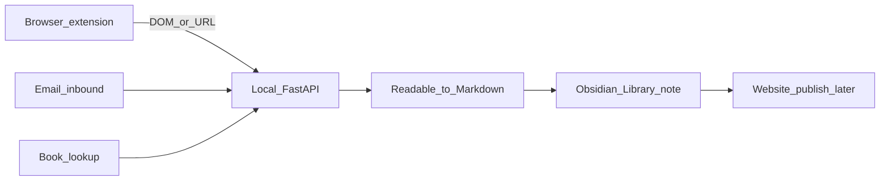

# Research Brief v1.0 — Matter 对标：技术要点与可行性

**Status:** Technical feasibility companion to product SoT  
**Date:** 2026-08  
**Scope:** Feasibility, architecture choices, gaps, milestones. Not implementation.

> **Product SoT:** [`PRODUCT_v1.md`](PRODUCT_v1.md)  
> **This document:** how (and how far) we can technically deliver that product, especially vs Matter.  
> **[`ARCHITECTURE.md`](ARCHITECTURE.md):** historical Knowledge OS stack. Capture-must-not-write-vault and Website-as-non-goal are **reversed** for v1 engineering; do not implement Library against both docs as if they agreed.

---

## 1. 结论摘要

**现有能力不能直接复刻 Matter 的基础体验。**

可复用：抓取骨架（connectors）、邮件入口、Content Lake 字节存储、本地 FastAPI。  
必须新建：正文可读解析、图文 Markdown、写入 Obsidian Library、浏览器保存入口、最小高亮路径、书目补全、Website 镜像。

Matter 真正难的是 **parsing**，以及在「用户浏览器里已经能看见」的页面上取正文（付费墙场景）——不是 SQLite、Lifecycle 或 Graph。

**总判：** 按 PRODUCT_v1 对齐，可做出 **Save → 私人库可读 → 轻标注** 约 **60–70%** 的基础闭环；短期**不能**用现有代码「变成 Matter」。阅读 App 级排版、TTS、关注作者、阅读队列不在对标范围内。

---

## 2. Matter 能力拆解与对标边界

### 2.1 Matter 基础能力（我们关心的部分）

| 能力 | Matter 侧要点 |
|------|----------------|
| Save | 浏览器扩展 / 分享；一键入库 |
| Parse | 多层启发式抽正文；持续回归测试；图文保留；已登录页可见内容可存 |
| Read | 独立阅读 App（字体、夜间、进度） |
| Highlight | App 内流畅高亮 + 笔记；官方 Obsidian 插件主要同步高亮 |
| Newsletter | Gmail / 专属转发地址 |
| Extra | TTS、关注作者、队列等 |

Matter 自身也承认：网页解析前 80–90% 相对容易，**最后一公里是无穷边角**（见 [How Matter Approaches Parsing](https://www.getmatter.com/how-matter-approaches-parsing)）。

### 2.2 我们对标什么 / 不对标什么

| 对标（对齐 PRODUCT_v1） | 不对标 |
|-------------------------|--------|
| 一键保存网页到私人库 | 独立 iOS/Web 阅读 App |
| 正文 + 图片可读落盘（Obsidian） | Matter 级排版与 TTS |
| 邮件/newsletter 入库 | 关注作者 / 社交阅读 |
| 轻量高亮与批注 | App 内长按高亮手势引擎 |
| 书名 → 书目卡片 | 全书 OCR / EPUB 阅读器 |
| Website 精选/整库镜像 | Matter 的云同步与多端原生体验 |

**角色差异：** Matter 的主阅读面是 App，Obsidian 插件是高亮导出。我们的主库**就是** Obsidian；Website 是对外镜像。因此 v1 **不以 Obsidian 插件作保存主入口**。

---

## 3. 现有代码资产与缺口

### 3.1 对照表

| Matter / PRODUCT 能力 | 本仓库现状 | 判定 |
|----------------------|------------|------|
| 一键保存网页 | 无浏览器扩展；仅 CLI / `POST /api/collect` | **缺口** |
| 正文+排版+图片 | [`connectors/web.py`](../backend/app/connectors/web.py) 全页 regex 去标签 → 纯文本 ≤30k；无 Readability / markdownify；媒体进 Content Lake | **关键缺口** |
| 邮件入库 | IMAP + [`email_pipeline.py`](../backend/app/services/email_pipeline.py)（可跟链抓文） | **可复用**，需改写 vault |
| RSS | [`connectors/rss.py`](../backend/app/connectors/rss.py)；无 enclosure/图 | 半成品 |
| 微信 | [`connectors/wechat.py`](../backend/app/connectors/wechat.py) 抽 `#js_content`（相对最好） | 可复用解析思路；扩展 DOM 仍更稳 |
| 高亮与笔记 | 无模型/API；书模板仅空 `## Highlights` | **缺口** |
| Obsidian 写入正文 | Capture **故意不写**（`sources_written=0`）；[`workspace.py`](../backend/app/services/workspace.py) 只 sync concept/project/… | **需翻转** |
| 书目 lookup | 无 Open Library / ISBN / 豆瓣 | **缺口** |
| TTS / 队列 / 关注作者 | 无 | v1 **不做** |
| Website | 无 | PRODUCT_v1 核心出口，另建 |

### 3.2 可复用资产

| 资产 | 路径 / 入口 | 用途 |
|------|-------------|------|
| `FetchedDoc` / `MediaAsset` | [`connectors/base.py`](../backend/app/connectors/base.py) | 统一抓取结果形状 |
| Web / WeChat / RSS / Email / Manual / PubMed | [`connectors/`](../backend/app/connectors/) | URL/源拉取骨架 |
| Content Lake | [`content_lake.py`](../backend/app/services/content_lake.py) | 可选后台字节备份（用户不可见） |
| Collect API | `POST /api/collect`，[`collect.py`](../backend/app/services/collect.py) | 可演化为或旁路到 Library save |
| Inbound email | `POST /inbound/email`，[`email_pipeline.py`](../backend/app/services/email_pipeline.py) | newsletter 次路径 |
| Manual paste | [`connectors/manual.py`](../backend/app/connectors/manual.py) | 无 URL 时的正文导入 |

### 3.3 必须新建

1. **Readable → Markdown**（含标题层级、链接、图片引用）
2. **`library_writer`** — 按 PRODUCT_v1 写 `Library/Articles|Emails|Books/` + `Library/Attachments/{id}/`
3. **浏览器扩展（MV3）** — 主保存入口
4. **`POST /api/library/save`**（及 books 端点）+ 扩展 CORS / token
5. **最小高亮路径**（篇内 `## Highlights` 或选区追加）
6. **Open Library 书目查询**
7. **Website publish 镜像**（PRODUCT_v1 §8）

---

## 4. 推荐架构

不对齐 Matter 全产品；对齐 PRODUCT_v1 最小闭环：

### 4.1 三条保存路径（优先级锁定）

1. **浏览器扩展（主路径）**  
   对标 Matter「我浏览器里能看见就能存」。扩展取当前 tab 的 DOM（或选区 HTML）+ URL + title → `POST` 本地 API → 解析为 Markdown → 图片下载到 vault 附件并改写相对路径。  
   **付费墙：** 依赖用户已登录页面的 DOM，**不**依赖服务端裸爬。

2. **邮件转发 / IMAP（次路径）**  
   复用现有 inbound；落盘目标从「仅 Lake/SourceDoc」改为 Library 笔记。

3. **URL 服务端抓取（兜底）**  
   复用 `WebConnector`；仅适合公开页。解析质量与付费墙能力弱于扩展 DOM。

### 4.2 Obsidian 插件角色

- v1：**不做**保存主入口。
- 阅读与批注：Obsidian 原生打开笔记 + 篇内 `## Highlights` / `## Notes`。
- Matter 官方 Obsidian 插件是 **highlights 同步到 vault**；我们的主库已是 vault，角色不同。
- 若以后需要结构化高亮 API 或一键 visibility 切换，再补**轻量** Obsidian 插件（后置里程碑）。

---

## 5. 浏览器插件设计要点（Chrome / Edge MV3）

Safari 后置。

| 项 | 选择 |
|----|------|
| 形态 | Manifest V3：toolbar 按钮 + 可选右键「Save to Library」 |
| 权限 | `activeTab`、`scripting`；`storage` 存 API base URL 与 token |
| 采集 | `chrome.scripting.executeScript` 取 `document.documentElement.outerHTML`（或扩展内先跑 Readability）+ `location.href` + `document.title` |
| 传输 | `POST http://127.0.0.1:8000/api/library/save`（新建；CORS 放行扩展 origin） |
| 鉴权 | 本地单用户：`.env` shared token ↔ 扩展设置 |
| 失败 UX | toast：API 未启动 / 解析失败 / 鉴权失败 |

**扩展内预清洗（推荐）：** 使用 [@mozilla/readability](https://github.com/mozilla/readability) 得到清洁 HTML 再上传，减轻服务端噪声。

**选区高亮（增强）：** 右键「Append highlight」→ 按 URL 定位已有 Library 笔记 → 追加到 `## Highlights`。

仓库布局建议（实施时）：`extension/` 与 `backend/` 并列；本阶段不建目录。

---

## 6. 解析与图文技术方案

### 6.1 推荐库组合（锁定，避免双轨）

| 层 | 技术 | 职责 |
|----|------|------|
| 扩展（可选先跑） | `@mozilla/readability` | 浏览器侧抽 article DOM |
| 服务端正文 | `readability-lxml` 为主；难站可辅以 `trafilatura` | HTML → 清洁 HTML / 文本 |
| HTML → Markdown | `markdownify`（或等价） | 保留标题、列表、链接、图片 |
| HTTP | 现有 `httpx` | 拉公开页与图片 |
| 图片 | 下载到 `Library/Attachments/{item_id}/`，正文改相对路径 | Obsidian 可渲染 |

加入 `requirements.txt` 在**工程实施阶段**执行；本文不改依赖文件。

### 6.2 相对现行 `web.py` 的翻转

| 现行 | v1 Library 路径 |
|------|-----------------|
| 全页 regex strip → 纯文本 | Readability 抽正文 → Markdown |
| 图片 URL 进 metadata / Lake | 图片字节进 **vault 附件**，链进笔记 |
| Collect 不写 Obsidian | **必须**写一篇 Library 笔记 |
| 截断 30k 纯文本 | 以可读正文为准；过大可分页或截断并注明 |

旧 Constitution「Resources never sync」对 **Library 路径失效**；旧 promote/concept 路径可冻结，不阻塞 v1。

### 6.3 服务端落盘形状

新建概念服务 `library_writer`（名称实施时可调整）：

- 模板对齐 PRODUCT_v1 §7.2（frontmatter + 正文 + `## Highlights` + `## Notes`）
- 目录：`Library/Articles/`、`Library/Emails/`、`Library/Books/`、`Library/Attachments/{id}/`
- 去重：按 `canonical_url` / Message-ID / ISBN 更新或跳过
- Content Lake：可选双写备份；**不是**用户可见主存储

### 6.4 书目

- `POST /api/library/books`：书名（或 ISBN）→ **Open Library API**（免密钥，作 v1 默认）
- 写入 `Library/Books/` 卡片（书名、作者、封面 URL 或本地下载、简介、ISBN）
- **不**把豆瓣作 v1 硬依赖（反爬与条款风险）

### 6.5 高亮（最小）

- 默认：用户在 Obsidian 中手写 `## Highlights`
- 增强：扩展「保存选区」追加条目
- **不做** Matter 级阅读器内长按高亮 UI

---

## 7. 可达性矩阵与风险

### 7.1 可达性

| 目标（Matter 基础） | v1 可达性 | 说明 |
|---------------------|-----------|------|
| Save article | **可达** | 扩展 + API + vault 写 |
| Clean reading layout | **部分可达** | Obsidian 渲染 Markdown；精致度不及 Matter App |
| Images in article | **可达** | 附件目录 + 相对路径 |
| Newsletters | **可达** | 现有 email 管道改造落盘 |
| Highlights | **弱可达** | 篇内 Markdown；非 App 手势 |
| Follow writers / TTS / queue | **不可达（不做）** | 明确非目标 |
| Paywalled save | **条件可达** | 仅扩展 DOM；服务端 URL 抓取不行 |
| Book by title | **可达** | Open Library |
| Public website mirror | **可达**（另里程碑） | PRODUCT_v1 Publish；非 Matter 对等项 |

### 7.2 风险

| 风险 | 影响 | 缓解 |
|------|------|------|
| 解析边角（SPA、多栏、自定义组件） | 正文残缺/噪声 | 扩展 DOM + Readability；难站接受「不够完美」；积累失败样例 |
| 付费墙 | 服务端抓取失败 | **强制主路径走扩展**；文档写清预期 |
| 微信 / 反爬 / 验证码 | 服务端不稳定 | 优先用户打开页后扩展保存；现有 wechat connector 仅兜底 |
| 图片热链失效 / 防盗链 | 图裂 | 保存时下载到 vault |
| 本地 API 未启动 | 扩展保存失败 | 清晰 toast；可选开机启动 uvicorn 说明 |
| 版权与公开镜像 | 误公开全文 | 默认 `visibility=private`；Website 仅精选或显式整库 |

---

## 8. 与 PRODUCT_v1 / ARCHITECTURE 的关系

| 文档 | 角色 |
|------|------|
| [`PRODUCT_v1.md`](PRODUCT_v1.md) | **产品与运作逻辑 SoT**（要什么） |
| **本文** | **技术可行性与工程路径**（怎么做、能做多像） |
| [`ARCHITECTURE.md`](ARCHITECTURE.md) | **历史 Knowledge OS** + vNext 库存；Lifecycle / Graph 不进入 v1 主路径 |

### 工程翻转（相对 ARCHITECTURE）

| 旧原则 | v1 工程原则 |
|--------|-------------|
| Capture never mirrors articles into vault | Capture / Save **必须**写 Library 笔记 |
| Obsidian = Thinking Workspace only | Obsidian = **私人阅读库** |
| Website UI = non-goal | Website = **对外核心出口**（独立里程碑） |
| Lifecycle / Graph 为主叙事 | **冻结**；不阻塞 Library |

实施 Library 时以 PRODUCT_v1 + 本文为准；不要再把 `workspace_role=resource → never sync` 当作保存路径的正确行为。

---

## 9. 建议里程碑（无工期承诺）

按依赖顺序推进；本阶段**不实施**。

| 顺序 | 里程碑 | 验收标准（摘要） |
|------|--------|------------------|
| M1 | Readable parse + `library_writer` + `POST /api/library/save` | URL 或 HTML POST → vault 出现可读 Markdown + 本地图片 |
| M2 | Chrome MV3 最小扩展 | 一键把当前页存进 Library；API 挂掉有提示 |
| M3 | Email inbound → Library 笔记 | 转发邮件 → `Library/Emails/`（或跟链文章）可读笔记 |
| M4 | Open Library 加书 | 书名 → `Library/Books/` 卡片 |
| M5 | Website 镜像 | `visibility=public` 出现在公开流/详情页 |
| M6 | （可选）选区高亮 / 轻量 Obsidian 插件 | 选区追加 `## Highlights`；或 vault 内快捷改 visibility |

**不要**在 M1–M2 之前重做 Lifecycle/Graph；那会再次打散 Matter 式闭环。

---

## 10. 本阶段边界

本文只回答：对标 Matter 的技术要点、现有能力能否复刻基础功能、插件与解析怎么做。

**不包含：** 改 backend、建 `extension/`、改 vault、改 `requirements.txt`、实现 Website。

落地时另开工程计划，验收标准引用本文 §7 与 §9，以及 [`PRODUCT_v1.md`](PRODUCT_v1.md) §4–§8。

---

*When technical approach for v1 Library capture changes, update this file alongside PRODUCT_v1. Keep ARCHITECTURE.md as historical / vNext inventory.*
