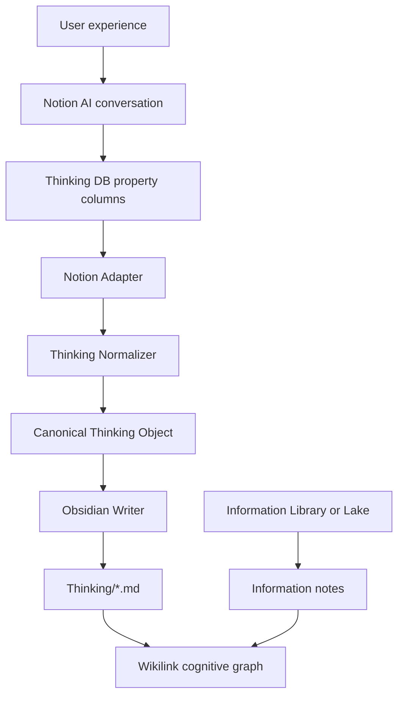

# Thinking Vault V1 — Architecture

**Status:** Canonical architecture SoT for Thinking Vault (2026-08 decision)  
**Priority:** Thinking Vault supersedes conflicting rules in [`PRODUCT_v1.md`](../PRODUCT_v1.md) and [`ARCHITECTURE.md`](../ARCHITECTURE.md) where they disagree.  
**Scope:** Capture → develop → connect personal thinking. Not a Research Engine, not bidirectional sync.

Related: [`THINKING_VAULT_MIGRATION.md`](THINKING_VAULT_MIGRATION.md) · [`NOTION_THINKING_DATABASE.md`](NOTION_THINKING_DATABASE.md)

---

## 0. Locked product decisions

| Decision | Choice |
|----------|--------|
| Product priority | **Thinking Vault first** |
| Information vs Thinking | Two separate flows; do not merge ingestion pipelines |
| Notion role | Thinking **input / interaction** layer |
| Obsidian role | **Canonical cognitive graph / memory** layer |
| Website role | Public presentation; consumes Obsidian-derived content later |
| Content Lake role | External **Information** memory only |
| Sync direction | **One-way Notion → Obsidian** only |
| Vault roots (target) | `Information/` · `Thinking/` · `Research/` |
| Thinking content SoT (V1) | **Notion Database property columns** (not page body) |
| Thinking authority after sync | Sync **overwrites** Obsidian files by `source_id` |
| SQLite role for Thinking | Sync index + optional KO/graph projection — **not** a second user-facing Thinking database |
| Graph (V1) | Meaningful Wikilinks only; Obsidian graph via `[[]]`; no auto-link explosion; `graph_engine` optional later |
| Research automation | Out of V1 |
| Sync transport | **Self-hosted backend** (Notion API + Writer); not third-party Notion↔Obsidian apps |

Experience target:

```text
I EXPERIENCE → I SPEAK → AI HELPS ME THINK → NOTION PROPERTIES REMEMBER
  → OBSIDIAN CONNECTS → THE GRAPH GROWS → RESEARCH EMERGES (later)
```

---

## 1. Existing architecture (as of audit)

The repo currently ships **two overlapping stacks**:

### 1.1 Knowledge OS (historical Constitution)

```text
Connectors → Content Lake + KnowledgeObject (SQLite)
  → promote / Reflection·Question·Insight
  → workspace.sync_note → Concepts|Projects|Reflections|Books|Reports
  → graph_engine (SQLite cognitive projection)
```

- Authority for thinking was **SQLite** (`reflections` etc.), with Obsidian as projection.
- Reflections are **human-owned**; bulk sync often **skips overwrite**.
- Vault roots: `Concepts/`, `Projects/`, `Reflections/`, … — **not** Information/Thinking/Research.
- Notion listed as **non-goal** (superseded).

### 1.2 Library v1 (PRODUCT_v1)

```text
Extension / URL → POST /api/library/save → Library/Articles|Emails|Books
```

- Obsidian treated as **private reading library** for Information.
- Health mode reports `library-v1`.

### 1.3 Reuse vs build

| Asset | Reuse |
|-------|--------|
| `workspace.py` natural stem / atomic write patterns | Yes — shared helpers for Thinking Writer |
| `library_writer.py`, Content Lake, collect | **Information only** — never Thinking |
| `thinking.py` Reflection CRUD → `Reflections/` | Transitional parallel path; **not** Notion UX |
| Notion client / Thinking Vault package | **Must build** |

---

## 2. New Thinking Vault architecture



**Boundary rule:** Adapter does not know Markdown shape. Writer does not know Notion API types. Normalizer is the contract seam.

**Page body** may hold scratch / AI chat residue. **V1 sync does not read page body** as Thinking content. Only named Database properties enter the Canonical Object.

---

## 3. Notion responsibility

Notion owns: mobile/fast capture, conversational clarify, Thinking Database, editing, lightweight Status, Related Information relations.

### 3.1 Property-column sync contract (SoT)

| Notion property | Type | Canonical field | Obsidian |
|-----------------|------|-----------------|----------|
| Name | Title | `title` | `# Title` + filename |
| Created | Created time | `created_at` | frontmatter `created` |
| Updated | Last edited time | `updated_at` | frontmatter `updated` |
| Status | Select | `status` | Index only (not body) |
| Raw Thought | Rich text | `raw_thought` | `## Raw Thought` |
| Context | Rich text | `context` | `## Context` |
| Observation | Rich text | `observation` | `## Observation` |
| Interpretation | Rich text | `interpretation` | `## Interpretation` |
| Uncertainty | Rich text | `uncertainty` | `## Uncertainty` |
| Questions | Rich text | `questions` (newline → list) | `## Questions` |
| Later Reflection | Rich text | `later_reflection` | `## Later Reflection` |
| Related Information | Relation | `connections[]` | `## Connections` + `[[Title]]` |

- Empty properties → **omit** the corresponding Markdown section.
- `source_id` = Notion page id (frontmatter only; not a user-facing column).
- Do **not** add domain/topic/priority/maturity columns in V1.
- Human setup checklist: [`NOTION_THINKING_DATABASE.md`](NOTION_THINKING_DATABASE.md).

### 3.2 Status → sync filter

| Status | Sync behavior |
|--------|----------------|
| *(empty)* or `Active` | Sync / update `Thinking/` |
| `Draft` | **Skip** (not written to vault) |
| `Archived` | Soft-archive under `Archive/Thinking/` (or keep archived mapping); do not hard-delete |

### 3.3 Capture protocol (how dialogue becomes properties)

```text
Conversation (ephemeral)
  → user confirms / AI assists filling Database properties
  → properties are the durable Thinking record
  → Sync reads properties only
```

V1 does not automate “chat → columns”. Operator fills (or pastes) properties before expecting Obsidian updates. AI must **never** overwrite an existing non-empty Raw Thought without explicit human replace.

### 3.4 Dual path note

- **Primary UX:** Notion → `Thinking/`
- **Legacy:** API/`thinking.py` → `Reflections/` remains until cutover; not the Thinking Vault path

---

## 4. Obsidian responsibility

### 4.1 Target vault roots

```text
Vault/
├── Information/          # target for world memory (Library/ transitional today)
├── Thinking/             # Notion-synced thinking objects (flat)
├── Research/             # thin in V1
├── Archive/Thinking/     # soft-deleted Notion pages
└── 90_Meta/
```

### 4.2 Markdown contract

```yaml
---
source: notion
source_id: <notion-page-id>
created: <date>
updated: <date>
---
```

Filename = human title (natural stem). Identity = `source_id`. Soft-archive path prefers `Archive/Thinking/`.

---

## 5. Sync boundary

```text
Notion API → Adapter → Normalizer → Canonical Thinking Object → Obsidian Writer → Thinking/*.md
```

| Rule | V1 policy |
|------|-----------|
| Direction | Notion → Obsidian only |
| Identity | `source_id` |
| Transport | Backend Sync (httpx/Notion API); CLI + `POST /api/thinking/sync`; cron poll OK |
| Create / Update | Write or overwrite by `source_id` |
| Rename | Rename file; keep `source_id` |
| Delete | Soft-archive; never hard-delete cognitive history |
| `preserve_existing_reflection_files` | Does **not** apply to Notion `Thinking/` writes |
| Idempotency | Content hash / last_edited; unchanged → no-op |

---

## 6. Canonical Thinking Object

```text
title
source          # "notion"
source_id
created_at
updated_at
status
raw_thought
context
observation
interpretation
uncertainty
questions[]           # from Questions rich text (newline-split)
later_reflection
connections[]         # {source_id?, title} → Wikilinks
```

Serialization / normalization / identity tests own this shape before network I/O.

---

## 7. Information integration

Keep pipelines separate. Meet only via Wikilinks. Do not route Notion through `collect` / `library_writer`.

V1 Related Information: prefer same-DB Thinking pages; cross-link to Information/Library by resolved title is best-effort (title collisions possible).

---

## 8–9. Graph & Research

V1 success = Wikilinks survive sync. No autonomous graph expansion. No auto Research Brief.

---

## 10. Implementation map

| New | Role |
|-----|------|
| `services/thinking_vault/model.py` | Canonical contract |
| `services/thinking_vault/normalizer.py` | Property bag → Canonical |
| `services/thinking_vault/markdown.py` | Canonical → Markdown body |
| `services/thinking_vault/adapter.py` | Notion read (later) |
| `services/thinking_vault/writer.py` | Write `Thinking/*.md` (later) |
| `services/thinking_vault/sync.py` | Orchestration (later) |
| `connectors/notion.py` | Thin API client (later) |
| Config | `NOTION_TOKEN`, `NOTION_THINKING_DATABASE_ID` |

---

## 11. Success criteria (Night Shift)

1. Properties filled in Notion; Sync → `Thinking/{Title}.md` with Raw Thought preserved.
2. Second sync → same file; no duplicate.
3. Rename → file renamed; same `source_id`.
4. Related Information → `[[…]]` under Connections.
5. `Draft` skipped; `Archived` soft-archived.

---

## 12. Explicit non-goals (V1)

Bidirectional sync · page-body-as-SoT · third-party Notion↔Obsidian apps as authority · taxonomy folders under Thinking · auto Research Brief · independent website Thinking DB · auto semantic links.
