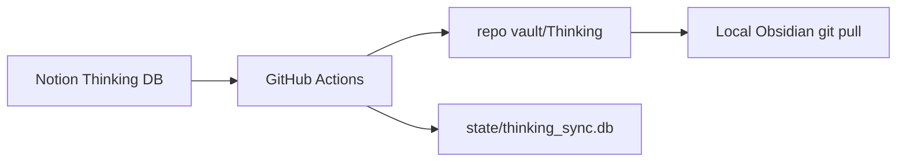

# Thinking Vault V1 — Architecture

**Status:** Canonical SoT (2026-08)  
**Scope:** Capture → develop → connect personal thinking. Not a Research Engine. Not bidirectional sync.

Related: [`NOTION_THINKING_DATABASE_CHECKLIST.md`](NOTION_THINKING_DATABASE_CHECKLIST.md)

---

## 0. Locked product decisions

| Decision | Choice |
|----------|--------|
| Product | **Thinking Vault only** |
| Notion role | Thinking **input / interaction** layer |
| Obsidian role | **Canonical cognitive graph / memory** layer |
| Sync direction | **One-way Notion → Obsidian** |
| Sync transport | **GitHub Actions** (schedule + `workflow_dispatch`); CLI for debug only |
| Vault roots | `Thinking/` · `Archive/Thinking/` |
| Thinking content SoT | Notion **property columns** + page body |
| Authority after sync | Sync **overwrites** Obsidian files by `source_id` |
| SQLite | Sync index only (`state/thinking_sync.db`, committed in git) |
| Graph | Meaningful Wikilinks only; no auto-link explosion |
| Local FastAPI / Knowledge OS / Library | Removed |

Experience target:

```text
I EXPERIENCE → I SPEAK → AI HELPS ME THINK → NOTION PROPERTIES REMEMBER
  → ACTIONS SYNC → OBSIDIAN CONNECTS → THE GRAPH GROWS
```

---

## 1. Runtime



| Piece | Role |
|-------|------|
| [`.github/workflows/thinking-sync.yml`](../../.github/workflows/thinking-sync.yml) | Every 6 hours + manual; commits `vault/` and the SQLite index |
| `python -m app.cli.thinking_sync` | Same engine, for local debug |
| Secrets | `NOTION_TOKEN`, `NOTION_THINKING_DATABASE_ID` |

If SQLite is empty on a run, sync **hydrates** `source_id` from on-disk notes and `.thinking-folder` sidecars so rename / soft-archive still work.

---

## 2. Sync pipeline

```text
Notion → Adapter → Normalizer → Canonical Thinking Object → Writer → Thinking/*.md
```

Adapter does not know Markdown shape. Writer does not know Notion blocks.

| Rule | V1 policy |
|------|-----------|
| Direction | Notion → Obsidian only |
| Identity | `source_id` (Notion page id) |
| Create | Write `Thinking/{Title}.md` |
| Update | Overwrite same file (idempotent by content hash) |
| Rename | Rename file; keep `source_id` |
| Delete | Soft-archive under `Archive/Thinking/`; never hard-delete |
| Failure | Visible logs; atomic writes |

---

## 3. Notion property contract

| Notion property | Type | → Canonical | → Obsidian |
|-----------------|------|-------------|------------|
| Name | Title | `title` | `# Title` + filename |
| Created | Created time | `created_at` | frontmatter `created` |
| Updated | Last edited time | `updated_at` | frontmatter `updated` |
| Status | Select | `status` | index only; `folder` triggers directory sync |
| Raw Thought | Rich text | `raw_thought` | `## Raw Thought` |
| Context | Rich text | `context` | `## Context` as `[[A]]; [[B]]` |
| Observation | Rich text | `observation` | `## Observation` |
| Interpretation | Rich text | `interpretation` | `## Interpretation` |
| Uncertainty | Rich text | `uncertainty` | `## Uncertainty` |
| Questions | Rich text | `questions` | `## Questions` |
| Later Reflection | Rich text | `later_reflection` | `## Later Reflection` |
| Related Information | Relation | `connections[]` | `## Connections` + `[[Title]]`; folder membership |
| Tags | Multi-select | `tags` | page-bottom `#tag` |
| *(page body)* | Blocks | `page_body` | `## Extended Reflection` |

Empty properties / empty page body are omitted. Raw Thought must never be replaced by AI polish.

**Status = `folder`:** create a real directory named after `Name`; Related members move into it; properties and page body stay Notion-only. Identity: `.thinking-folder` sidecar.

Do **not** add domain / topic / priority / maturity taxonomies in V1.

---

## 4. Markdown contract

```yaml
---
source: notion
source_id: <notion-page-id>
created: <date>
updated: <date>
---
```

Filename = human title (natural stem). Identity = `source_id`, never filename.

---

## 5. Implementation map

| Module | Role |
|--------|------|
| [`backend/app/services/thinking_vault/model.py`](../../backend/app/services/thinking_vault/model.py) | Canonical Thinking Object |
| [`backend/app/services/thinking_vault/notion_client.py`](../../backend/app/services/thinking_vault/notion_client.py) | Thin Notion API read client |
| [`backend/app/services/thinking_vault/adapter.py`](../../backend/app/services/thinking_vault/adapter.py) | Fetch DB pages, properties, relations |
| [`backend/app/services/thinking_vault/normalizer.py`](../../backend/app/services/thinking_vault/normalizer.py) | Properties → canonical object |
| [`backend/app/services/thinking_vault/writer.py`](../../backend/app/services/thinking_vault/writer.py) | Canonical → `Thinking/*.md` |
| [`backend/app/services/thinking_vault/sync.py`](../../backend/app/services/thinking_vault/sync.py) | Idempotent sync + hydrate + soft-archive |
| `thinking_sync_state` table | `source_id` ↔ `vault_path` + hashes |
| `python -m app.cli.thinking_sync` | CLI |
| Tests | `backend/tests/test_thinking_vault.py` |

---

## 6. Success criteria

1. Capture in Notion; sync once → `Thinking/{Title}.md` with Raw Thought preserved.
2. Sync again → same file updated; no duplicate.
3. Title rename → file renamed; same `source_id`.
4. Related Information → `[[Wikilink]]`.
5. Notion page gone → note moves to `Archive/Thinking/`.

---

## 7. Explicit non-goals (V1)

Bidirectional sync · autonomous graph generation · heavy ontology/tags · local FastAPI · Knowledge OS / Library / collect / lifecycle · public website Thinking DB · auto Research Brief.
