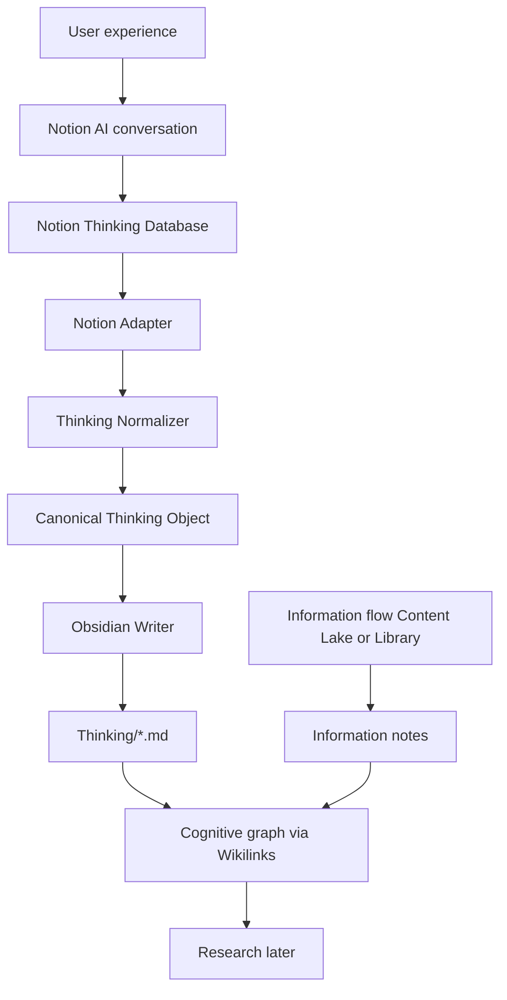

# Thinking Vault V1 — Architecture

**Status:** Canonical architecture SoT for Thinking Vault (2026-08 decision)  
**Priority:** Thinking Vault supersedes conflicting rules in [`PRODUCT_v1.md`](../PRODUCT_v1.md) and [`ARCHITECTURE.md`](../ARCHITECTURE.md) where they disagree.  
**Scope:** Capture → develop → connect personal thinking. Not a Research Engine, not bidirectional sync.

Related: [`THINKING_VAULT_MIGRATION.md`](THINKING_VAULT_MIGRATION.md)

---

## 0. Locked product decisions

| Decision | Choice |
|----------|--------|
| Product priority | **Thinking Vault first** |
| Information vs Thinking | Two separate flows; do not merge ingestion pipelines |
| Notion role | Thinking **input / interaction** layer |
| Obsidian role | **Canonical cognitive graph / memory** layer |
| Website role | Public presentation; consumes Obsidian-derived content later |
| Content Lake role | External **Information** memory only |
| Sync direction | **One-way Notion → Obsidian** only |
| Vault roots (target) | `Information/` · `Thinking/` · `Research/` |
| Thinking authority after sync | Notion page is SoT for Thinking content; sync **overwrites** corresponding Obsidian files by `source_id` |
| SQLite role for Thinking | Sync index + optional KO/graph projection — **not** a second user-facing Thinking database |
| Graph | Meaningful Wikilinks only; no infrastructure nodes; no auto-link explosion |
| Research automation | Out of V1 |

Experience target:

```text
I EXPERIENCE → I SPEAK → AI HELPS ME THINK → NOTION REMEMBERS
  → OBSIDIAN CONNECTS → THE GRAPH GROWS → RESEARCH EMERGES (later)
```

---

## 1. Existing architecture (as of audit)

The repo currently ships **two overlapping stacks**:

### 1.1 Knowledge OS (historical Constitution)

```text
Connectors → Content Lake + KnowledgeObject (SQLite)
  → promote / Reflection·Question·Insight
  → workspace.sync_note → Concepts|Projects|Reflections|Books|Reports
  → graph_engine (SQLite cognitive projection)
```

- Authority for thinking was **SQLite** (`reflections` etc.), with Obsidian as projection.
- Reflections are **human-owned**; bulk sync often **skips overwrite**.
- Vault roots: `Concepts/`, `Projects/`, `Reflections/`, … — **not** Information/Thinking/Research.
- Notion listed as **non-goal**.

### 1.2 Library v1 (PRODUCT_v1)

```text
Extension / URL → POST /api/library/save → Library/Articles|Emails|Books
```

- Obsidian treated as **private reading library**.
- Website publish designed but not implemented as a DB layer.
- Health mode reports `library-v1`.

### 1.3 What already exists and will be reused

| Asset | Path | Reuse in Thinking Vault |
|-------|------|-------------------------|
| KO spine | `backend/app/db.py` `KnowledgeObject` | Optional index row + graph eligibility |
| Thinking CRUD | `backend/app/services/thinking.py` | Adapt or wrap; do not fork a parallel CRUD for UI |
| Workspace writer | `backend/app/services/workspace.py` | Natural titles, rename/collision, atomic write patterns |
| Graph engine | `backend/app/services/graph_engine.py` | Post-sync `maybe_auto_sync`; no auto edge spam |
| Lifecycle events | `backend/app/services/lifecycle.py` | Audit trail for sync runs if useful |
| Inbound webhook pattern | `POST /api/inbound/email` | Template for optional Notion webhook later |
| CLI sync pattern | `app.cli.workspace` | Mirror for `sync-thinking` |
| Content Lake + collect | `content_lake`, `collect`, connectors | **Keep for Information only** — do not feed Thinking |
| Library writer | `library_writer.py` | **Keep for Information reading notes** — do not write Thinking |

### 1.4 Missing (must build)

> **Audit 2026-08-20:** The list below was the V1 gap analysis. On `main` these modules exist (`backend/app/services/thinking_vault/`, CLI, `POST /api/thinking/sync`, GitHub Actions). Remaining work is Phase 6–7 (graph wiring, website as consumer) — see [`STATUS_AND_PLANNING.md`](STATUS_AND_PLANNING.md). Keep this subsection as historical context; do not treat it as a current backlog.

- Notion API client / adapter
- Thinking Normalizer + canonical Thinking Object contract
- Dedicated Obsidian Writer targeting `Thinking/`
- Sync engine (idempotent, `source_id`-keyed, rename/archive policies)
- Sync state store (page id → vault path, hashes, cursors)
- Notion token / database id config
- Trigger: CLI + API; periodic poll acceptable for V1

---

## 2. New Thinking Vault architecture



**Boundary rule:** Adapter does not know Markdown shape. Writer does not know Notion blocks. Normalizer is the contract seam so Notion can be replaced later.

---

## 3. Notion responsibility

Notion owns:

- Mobile / fast capture
- Conversational clarify (CAPTURE / CLARIFY / CONNECT / DEVELOP as behaviors)
- Thinking Database with **predefined property columns** (V1 content contract)
- Lightweight status + Related Information relations
- Editing and recent review

Notion does **not** own:

- Canonical cognitive graph
- Long-term Markdown intellectual history
- Website presentation
- Content Lake / crawler memory

### 3.1 Thinking Database — property columns are content SoT (V1)

**MODIFY (locked):** V1 sync reads **Database property columns** for structured slots,
**and also syncs the Notion page body** as detailed reflection.

| Layer | Role |
|-------|------|
| Property columns | Compact structured fields (index + core slots) |
| Page body (blocks) | Longer, finer reflection / narrative — synced to Obsidian |

Empty properties / empty page body are omitted on export. Raw Thought must never be replaced by AI polish.

| Notion property | Type | → Canonical | → Obsidian |
|-----------------|------|-------------|------------|
| Name | Title | `title` | `# Title` + filename |
| Created | Created time | `created_at` | frontmatter `created` |
| Updated | Last edited time | `updated_at` | frontmatter `updated` |
| Status | Select | `status` | index/log only (not graph); `folder` triggers directory sync |
| Raw Thought | Rich text | `raw_thought` | `## Raw Thought` (skipped when Status=`folder`) |
| Context | Rich text | `context` | `## Context` as `[[A]]; [[B]]` (semicolon-separated anchors; skipped for `folder`) |
| Observation | Rich text | `observation` | `## Observation` (skipped for `folder`) |
| Interpretation | Rich text | `interpretation` | `## Interpretation` (skipped for `folder`) |
| Uncertainty | Rich text | `uncertainty` | `## Uncertainty` (skipped for `folder`) |
| Questions | Rich text | `questions` | `## Questions` (skipped for `folder`) |
| Later Reflection | Rich text | `later_reflection` | `## Later Reflection` (skipped for `folder`) |
| Related Information | Relation | `connections[]` | notes: `## Connections` + `[[Title]]`; **folder**: membership → move notes into `Title/` |
| *(page body blocks)* | Blocks | `page_body` | `## Extended Reflection` (skipped for `folder`) |

#### Status = `folder` (real directory sync)

- Obsidian creates a **real folder** named after `Name` (no index / MOC note).
- `Related Information` lists member Thinking pages; sync moves those `.md` files into the folder.
- Nested folders are allowed when a folder relates to another folder; cycles are skipped with an error.
- If multiple folders claim the same note, the **lexicographically smallest folder title** wins (warning logged).
- Folder page properties + page body stay **Notion-only** (AI writing / style guidance); they never become Obsidian sections.
- Folder identity: SQLite `ThinkingSyncState.vault_path` points at the directory; a hidden `.thinking-folder` sidecar stores `source_id` + `title`.

**Do not** add domain/category/topic/priority/maturity taxonomies in V1.

See manual setup: [`NOTION_THINKING_DATABASE_CHECKLIST.md`](NOTION_THINKING_DATABASE_CHECKLIST.md).

---

## 4. Obsidian responsibility

Obsidian owns:

- Long-term human-readable Thinking Objects
- Wikilinks and cognitive graph
- Relationships between Information and Thinking
- Downstream research synthesis (human + later tooling)

### 4.1 Target vault roots

```text
Vault/
├── Information/     # external world memory (Library path may map here over time)
├── Thinking/        # personal thinking objects from Notion sync
├── Research/        # downstream; thin in V1
├── Archive/         # soft-delete / history
└── 90_Meta/         # conventions only — never graph nodes
```

Constitution folders (`Reflections/`, `Concepts/`, `Projects/`, `Library/`, …) are **legacy or transitional** — see Migration doc.

### 4.2 Markdown contract

Frontmatter (minimal):

```yaml
---
source: notion
source_id: <notion-page-id>
created: <timestamp>
updated: <timestamp>
---
```

Filename = human title (natural stem). Identity = `source_id`, never filename.

Body sections only when non-empty. Connections become `[[Wikilinks]]`.

---

## 5. Sync boundary

```text
Notion → Adapter → Normalizer → Canonical Thinking Object → Obsidian Writer → Thinking/*.md
```

| Rule | V1 policy |
|------|-----------|
| Direction | Notion → Obsidian only |
| Identity | `source_id` (Notion page id) |
| Create | Write new `Thinking/{Title}.md` |
| Update | Overwrite same file (idempotent) |
| Rename | Rename file; keep `source_id` |
| Delete | Soft-archive under `Archive/` (or mark); do not hard-delete |
| Trigger | CLI + API sync; optional 5–15 min poll; webhook only if cheap to add |
| Failure | Visible logs; no silent corruption; prefer atomic writes |
| Graph | Preserve user/relation Wikilinks; propose links conservatively; no auto spam |

SQLite may store sync state (`source_id`, content hash, `vault_path`, last synced) and optionally a KO/`thinking` row for graph views — it is an **index**, not a competing editor.

---

## 6. Canonical Thinking Object

Internal contract (not a user-facing form). Populated from Notion **property columns**:

```text
title
source          # "notion"
source_id
created_at
updated_at
raw_thought
context
observation
interpretation
uncertainty
questions       # string (rich text); may contain list lines
later_reflection
page_body       # Notion page blocks → Markdown (Extended Reflection)
connections[]   # {source_id?, title} resolved to Wikilink targets
status
```

Serialization/normalization/identity tests own this shape before any UI work.

---

## 7. Information integration

Keep pipelines separate:

```text
WORLD → Capture/Library/Lake → Information objects → Obsidian Information (or Library transitional)
ME    → Notion AI → Thinking DB → Thinking objects → Obsidian Thinking/
```

They meet only in the cognitive graph via meaningful Wikilinks, then optionally Research.

Do **not**:

- Route Notion pages through `collect` / `persist_fetched`
- Route Thinking through `library_writer`
- Dump Resources into `Thinking/`

---

## 8. Graph integration

Valid nodes: Information · Thinking · Research (plus existing Concept/Project notes while transitional).

Valid edges: meaningful Wikilinks / confirmed relations.

Never graph: Notion, Database, API, Sync, Status, Folder, Template, Metadata, Pipeline, Content Lake infra.

V1: survive sync of known connections. Do **not** build autonomous graph expansion.

---

## 9. Research integration

Research remains downstream:

```text
Information + Thinking + Meaningful Connections → Research Question → Research Brief
```

No Research Engine, no auto Research Brief generation in V1.

---

## 10. Implementation map (smallest delta)

| Module | Role |
|--------|------|
| [`backend/app/services/thinking_vault/model.py`](../../backend/app/services/thinking_vault/model.py) | Canonical Thinking Object |
| [`backend/app/services/thinking_vault/notion_client.py`](../../backend/app/services/thinking_vault/notion_client.py) | Thin Notion API read client |
| [`backend/app/services/thinking_vault/adapter.py`](../../backend/app/services/thinking_vault/adapter.py) | Fetch DB pages, properties, relations |
| [`backend/app/services/thinking_vault/normalizer.py`](../../backend/app/services/thinking_vault/normalizer.py) | Properties → canonical object |
| [`backend/app/services/thinking_vault/writer.py`](../../backend/app/services/thinking_vault/writer.py) | Canonical → `Thinking/*.md` |
| [`backend/app/services/thinking_vault/sync.py`](../../backend/app/services/thinking_vault/sync.py) | Idempotent sync + soft-archive |
| `thinking_sync_state` table | `source_id` ↔ `vault_path` + hashes |
| `POST /api/thinking/sync` + `GET /api/thinking/sync/status` | Triggers / status |
| `python -m app.cli.thinking_sync` | CLI sync |
| Config | `NOTION_TOKEN`, `NOTION_THINKING_DATABASE_ID`, `workspace.yaml` `thinking_vault` |
| Checklist | [`NOTION_THINKING_DATABASE_CHECKLIST.md`](NOTION_THINKING_DATABASE_CHECKLIST.md) |
| Tests | `backend/tests/test_thinking_vault.py` |

**Reuse, do not rewrite:** Content Lake, collect connectors, Library save path, Graph rebuild mechanics, natural filename helpers from `workspace.py`.

**Website:** Phase 7 only — read Obsidian-derived Thinking; no independent website Thinking DB.

---

## 11. Success criteria (Night Shift)

1. User captures in Notion; AI clarifies; page titled e.g. “Dizziness is not Vertigo”.
2. Sync runs once → `Thinking/Dizziness is not Vertigo.md` with Raw Thought preserved.
3. Sync runs again → same file updated; no duplicate.
4. Title rename → file renamed; same `source_id`.
5. Related Information → `[[Clinical communication]]` style Wikilinks.
6. Graph shows cognitive objects only.

---

## 12. Explicit non-goals (V1)

Bidirectional sync · autonomous graph generation · heavy ontology/tags · ad-hoc taxonomy folders under Thinking (except explicit `Status=folder` pages) · auto Research Brief · social/recommendation · custom Notion replacement · second website Thinking database.
